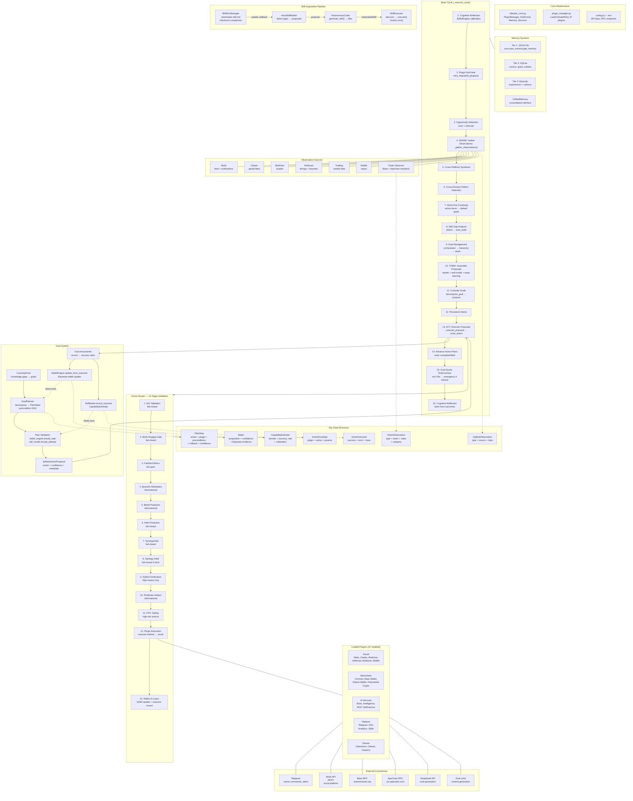

# AlleyBot Architecture

## How to Read This Diagram

| Color/Zone | Meaning |
|------------|---------|
| **Brain Cycle** | The main loop — runs every ~10 min, 16 phases |
| **Validation Ladder** | 12 gates every action passes through |
| **Goal System** | Curiosity → Plan → Validate → Execute → Learn → Update Beliefs |
| **Memory** | 4 tiers from simple JSON to vector DB |
| **Skill Pipeline** | Watches skill.md → auto-generates code → hot-loads |
| **Data Structures** | Contracts that pass between subsystems |

## Key Numbers

| Metric | Value |
|--------|-------|
| Source files | ~200+ |
| Brain cycle phases | 16 |
| Validation stages | 12 |
| Loaded plugins | 37 |
| External APIs | 6 major |
| Memory tiers | 4 |
| Skill system files | 15+ |
| LLM cost | ~$3/month |
| Runtime | $10/month VPS |
