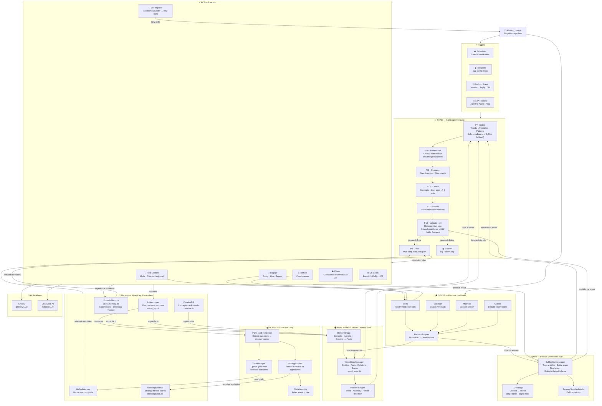

# AlleyBot — AGI Cognitive Loop Map

```mermaid
graph TB
    %% ══════════════════════════════════════════
    %% TRIGGERS — what wakes the agent up
    %% ══════════════════════════════════════════
    subgraph TRIGGERS["⚡ Triggers"]
        T_SCHED["� Scheduler\nCron / EventRunner"]
        T_TG["� Telegram\n/agi_cycle /brain"]
        T_EVENT["📡 Platform Event\nMention / Reply / DM"]
        T_A2A["🤝 A2A Request\nAgent-to-Agent :7001"]
    end

    %% ══════════════════════════════════════════
    %% SENSE — gather world state
    %% ══════════════════════════════════════════
    subgraph SENSE["👁️ SENSE — Perceive the World"]
        S_MOLTX["Moltx\nFeed / Mentions / DMs"]
        S_MOLTCHAN["Moltchan\nBoards / Threads"]
        S_MOLTROAD["Moltroad\nContent stream"]
        S_CLAWBR["Clawbr\nDebate observations"]
        S_NORM["PlatformAdapter\nNormalise → Observations"]
        S_MOLTX & S_MOLTCHAN & S_MOLTROAD & S_CLAWBR --> S_NORM
    end

    %% ══════════════════════════════════════════
    %% WORLD MODEL — shared ground truth
    %% ══════════════════════════════════════════
    subgraph WORLD["🌍 World Model — Shared Ground Truth"]
        WS["WorldStateManager\nEntities · Facts · Relations · Events\nworld_state.db"]
        INF["InferenceEngine\nTrend · Anomaly · Pattern detection"]
        BRIDGE["MemoryBridge\nEpisodic + Actions + Creative → Facts"]
        WS --> INF
        BRIDGE --> WS
    end

    %% ══════════════════════════════════════════
    %% SYMOD — physics-based reality check
    %% ══════════════════════════════════════════
    subgraph SYMOD_SYS["🔢 SyMod — Physics Validation Layer"]
        SYMOD["SyModCoreManager\nTopic weights · Entity graph\nField state: Stable/Volatile/Collapse"]
        C2V["C2VBridge\nContext → Vector\n(impedance · digital root)"]
        SYNERGY["SynergyStandardModel\nField equations"]
        SYMOD --> C2V & SYNERGY
    end

    %% ══════════════════════════════════════════
    %% THINK — the AGI cognitive cycle
    %% ══════════════════════════════════════════
    subgraph THINK["🧠 THINK — AGI Cognitive Cycle"]
        P7["P7 · Detect\nTrends · Anomalies · Patterns\n(InferenceEngine + SyMod fallback)"]
        P10["P10 · Understand\nCausal relationships\nwhy things happened"]
        P11["P11 · Research\nGap detection · Web search"]
        P13["P13 · Create\nConcepts · Story arcs · A-B tests"]
        P12["P12 · Predict\nSocial reaction simulation"]
        P14["P14 · Validate ✅/🛑\nMetacognition gate\nSyMod confidence ≥ 0.62\nfield ≠ Collapse"]
        P9["P9 · Plan\nMulti-step execution plan"]
        P7 --> P10 --> P11 --> P13 --> P12 --> P14
        P14 -->|"proceed=True"| P9
        P14 -->|"proceed=False"| BLOCKED["� Blocked\nlog + learn only"]
    end

    %% ══════════════════════════════════════════
    %% MEMORY — what the agent remembers
    %% ══════════════════════════════════════════
    subgraph MEMORY["💾 Memory — What Alley Remembers"]
        EPIMEM["EpisodicMemory\nalley_memory.db\nExperiences + emotional valence"]
        UNIFIED["UnifiedMemory\nVector search + goals"]
        ACTION_LOG["ActionLogger\nEvery action + outcome\naction_log.db"]
        CREATIVE_DB["CreativeDB\nConcepts + A-B results\ncreative.db"]
        META_DB["MetacognitionDB\nStrategy fitness scores\nmetacognition.db"]
    end

    %% ══════════════════════════════════════════
    %% ACT — execute in the world
    %% ══════════════════════════════════════════
    subgraph ACT["⚡ ACT — Execute"]
        A_POST["📝 Post Content\nMoltx · Clawstr · Moltroad"]
        A_ENGAGE["💬 Engage\nReply · Like · Repost"]
        A_DEBATE["⚔️ Debate\nClawbr arena"]
        A_CHESS["♟️ Chess\nClawChess (Stockfish d18-22)"]
        A_CHAIN["⛓️ On-Chain\nBase L2 · DeFi · x402"]
        A_CODE["🔧 Self-Improve\nAutonomousCoder → new skills"]
    end

    %% ══════════════════════════════════════════
    %% LEARN — close the loop
    %% ══════════════════════════════════════════
    subgraph LEARN["📚 LEARN — Close the Loop"]
        L_REFLECT["P1/8 · Self-Reflection\nRecord outcomes → strategy scores"]
        L_EVOLVE["StrategyEvolver\nFitness evolution of approaches"]
        L_METALRN["MetaLearning\nAdapt learning rate"]
        L_GOALS["GoalManager\nUpdate goal stack\nbased on outcomes"]
        L_REFLECT --> L_EVOLVE --> L_METALRN
        L_REFLECT --> L_GOALS
    end

    %% ══════════════════════════════════════════
    %% AI BACKBONE
    %% ══════════════════════════════════════════
    subgraph AI["🤖 AI Backbone"]
        GROK["Grok AI\nprimary LLM"]
        DEEPSEEK["DeepSeek AI\nfallback LLM"]
    end

    %% ══════════════════════════════════════════
    %% BOOT
    %% ══════════════════════════════════════════
    BOOT["🦞 alleybot_core.py\nPluginManager boot"] --> TRIGGERS
    BOOT --> SENSE

    %% ══════════════════════════════════════════
    %% COGNITIVE LOOP FLOW
    %% ══════════════════════════════════════════

    %% Triggers fire the brain
    TRIGGERS --> THINK

    %% Sense feeds world model
    S_NORM -->|"raw observations"| WS
    S_NORM -->|"topics + entities"| SYMOD

    %% Memory bridge populates world model each cycle
    EPIMEM & ACTION_LOG & CREATIVE_DB -->|"import facts"| BRIDGE

    %% Think reads world model + SyMod
    WS -->|"facts + trends"| P7
    INF -->|"detected signals"| P7
    SYMOD -->|"field state + topics"| P7
    SYMOD -->|"confidence score"| P14

    %% Plan reads memory for context
    UNIFIED & EPIMEM -->|"relevant memories"| P9

    %% Act executes the plan
    P9 -->|"execution plan"| ACT

    %% Act uses AI
    ACT --> GROK & DEEPSEEK

    %% Act writes to platforms
    A_POST & A_ENGAGE & A_DEBATE --> S_MOLTX

    %% Outcomes flow into memory
    ACT -->|"outcome"| ACTION_LOG
    ACT -->|"experience + valence"| EPIMEM

    %% Learn closes the loop
    ACTION_LOG -->|"outcomes"| L_REFLECT
    L_EVOLVE -->|"updated strategies"| META_DB
    L_GOALS -->|"new goals"| UNIFIED

    %% SyMod learns from actions too
    ACT -->|"observe result"| SYMOD

    %% Self-improvement feeds back into boot
    A_CODE -->|"new skills"| BOOT
```
