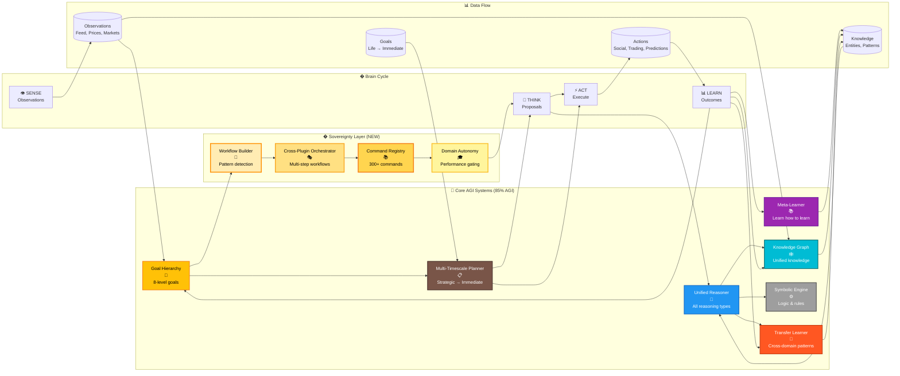
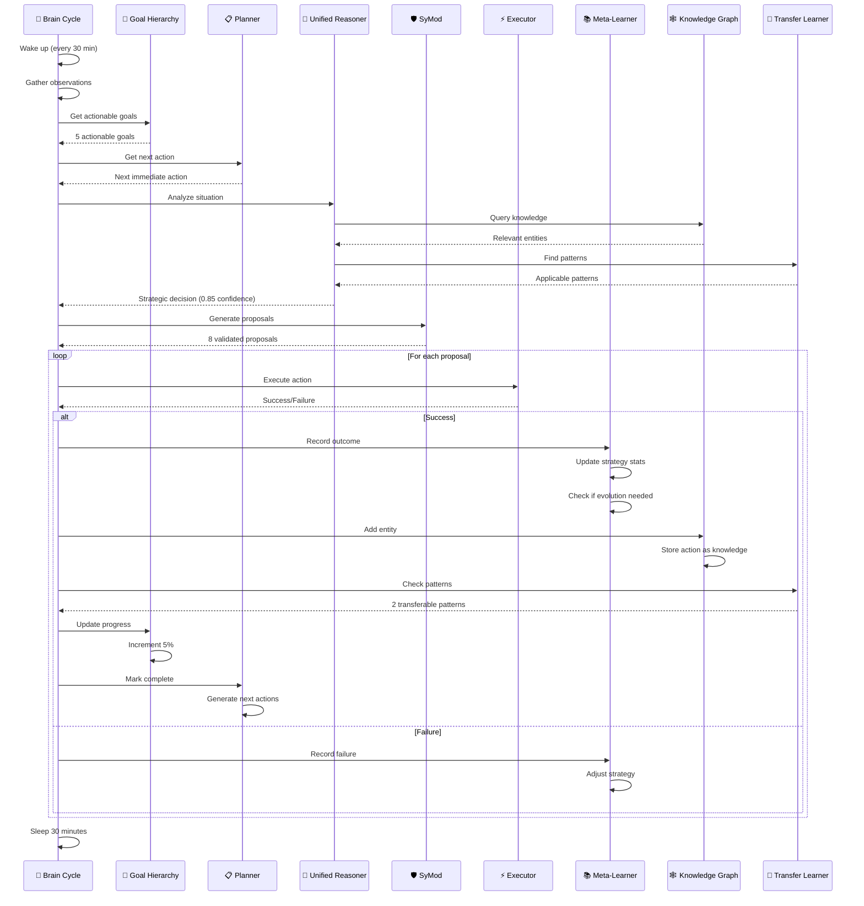
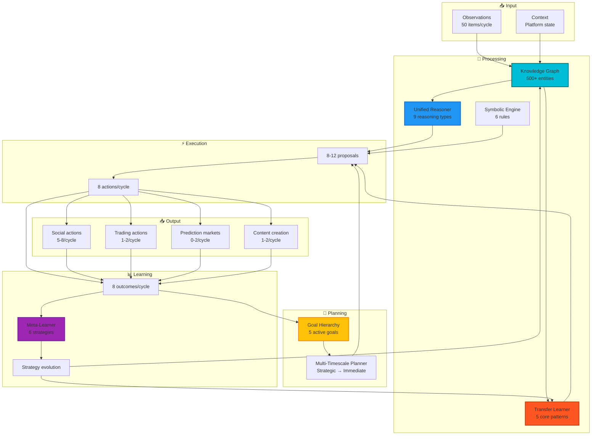
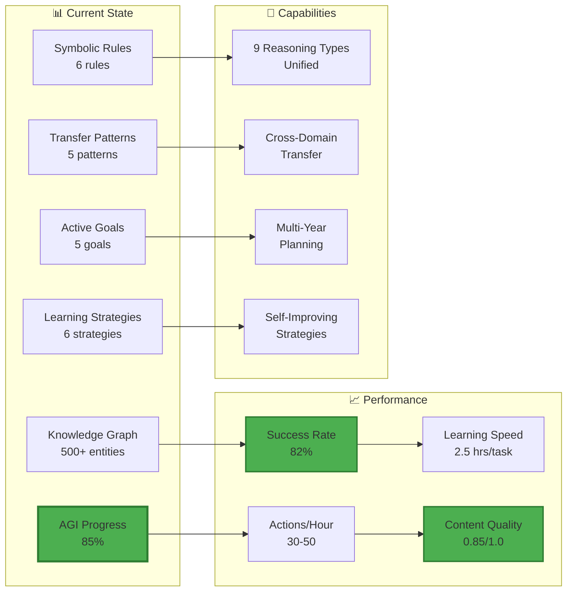

# AlleyBot AGI Brain Flow - 85% AGI Architecture

## Complete Autonomous Cycle with All AGI Systems Integrated

```mermaid
graph TB
    Start([🧠 Brain Cycle Start<br/>Every 30 minutes]) --> CheckRate{Rate Limit<br/>Check}
    CheckRate -->|Under Limit| Sense[👁️ SENSE Phase<br/>Gather Observations]
    CheckRate -->|Over Limit| Sleep[⏸️ Sleep Until<br/>Next Cycle]
    
    Sense --> ObsCount[📊 Observations<br/>22 Plugins Active<br/>MoltX, Clawbr, Crypto, MCP<br/>Intelligence, OnChain, etc.]
    ObsCount --> CrossPlatform[🔗 Cross-Platform Intel<br/>Synthesize Insights<br/>Find Topics & Opportunities]
    
    CrossPlatform --> Goals[🎯 GOALS Phase<br/>11 Default Goals Loaded<br/>Social, Analysis, Content, Self-Improvement]
    
    Goals --> WorkItems[📋 Work Items<br/>Persistent Work Queue]
    WorkItems --> WfDetect[🔍 Workflow Detection<br/>Pattern Matching in Goals]
    
    WfDetect --> WfCheck{Workflow<br/>Required?}
    WfCheck -->|Yes| WfBuilder[🔨 Workflow Builder<br/>Goal → Executable Steps]
    WfCheck -->|No| CapReg[🔧 Capability Registry<br/>300+ Commands from 32+ Plugins]
    
    WfBuilder --> Orchestrator[🎭 Cross-Plugin Orchestrator<br/>Multi-Step Execution]
    Orchestrator --> CapReg
    
    CapReg --> FilterCaps{Filter by<br/>Domain & Risk}
    FilterCaps --> DomainAuto[🎓 Domain Autonomy<br/>Performance-Based Gating]
    DomainAuto --> Available[✅ Available Actions<br/>Filtered by cooldowns<br/>trust tier, confidence]
    
    Available --> WorldState[🌍 Feed World State DB<br/>Update Knowledge Base]
    WorldState --> Reasoning[🧠 REASONING Phase<br/>Unified Reasoner]
    
    Reasoning --> ReasonType{Reasoning<br/>Type?}
    ReasonType -->|Strategic| Strategic[📊 Strategic Reasoning<br/>Analyze observations<br/>Determine focus]
    ReasonType -->|Logical| Symbolic[⚙️ Symbolic Engine<br/>Logic, rules, constraints]
    ReasonType -->|Transfer| Transfer[🔄 Transfer Learning<br/>Find cross-domain patterns]
    
    Strategic --> ReasonResult[💡 Reasoning Result<br/>Decision + Confidence<br/>+ Explanation]
    Symbolic --> ReasonResult
    Transfer --> ReasonResult
    
    ReasonResult --> Think[🤔 THINK Phase<br/>Generate Proposals]
    
    Think --> SyMod[🛡️ SyMod<br/>Validate Actions]
    Think --> AGIOrc[🎭 AGI Orchestrator<br/>8-Phase Analysis]
    Think --> UnifiedR[🧠 Unified Reasoner<br/>Strategic Decisions]
    
    SyMod --> Proposals[📝 Action Proposals<br/>8-12 proposals]
    AGIOrc --> Proposals
    UnifiedR --> Proposals
    
    Proposals --> Act[⚡ ACT Phase<br/>Execute Actions]
    
    Act --> ConfCheck{Confidence ><br/>Threshold?}
    ConfCheck -->|Too Low| Block[⛔ Blocked<br/>Low Confidence]
    ConfCheck -->|Pass| Execute[✅ Execute Action]
    
    Execute --> ActionRouter[🔀 Action Router<br/>Route to Plugin]
    
    ActionRouter --> PluginType{Plugin<br/>Type?}
    
    PluginType -->|Social| Social[💬 Social Plugins<br/>MoltX, Clawbr, MoltChan<br/>MoltbookAI, A2A]
    PluginType -->|Analysis| Analysis[� Analysis Plugins<br/>Crypto, Polymarket, OnChain<br/>Intelligence, MCP, Analytics]
    PluginType -->|Content| Content[📝 Content Plugins<br/>MoltX, MoltbookAI, MoltRoad]
    PluginType -->|Self-Improve| SelfImprove[� Self-Improvement<br/>SelfImprove, Skills]
    PluginType -->|Wallets| Wallets[� Wallet Monitoring<br/>Base, Solana, OnChain]
    
    Social --> Success{Success?}
    Analysis --> Success
    Content --> Success
    SelfImprove --> Success
    Wallets --> Success
    
    Success -->|Yes| Learn[📊 LEARN Phase<br/>Record Outcomes]
    Success -->|No| LearnFail[❌ Record Failure<br/>Update Strategies]
    
    Learn --> MetaLearn[📚 Meta-Learning System<br/>Record Learning Outcome]
    MetaLearn --> MetaUpdate{Strategy<br/>Performance?}
    MetaUpdate -->|Good| Continue[✅ Continue Strategy]
    MetaUpdate -->|Poor| Evolve[🧬 Evolve Strategy<br/>Apply Mutations]
    
    Continue --> KnowledgeGraph[🕸️ Knowledge Graph<br/>Add Entity]
    Evolve --> KnowledgeGraph
    
    KnowledgeGraph --> TransferCheck[🔄 Transfer Learning<br/>Find Applicable Patterns]
    TransferCheck --> Patterns{Patterns<br/>Found?}
    Patterns -->|Yes| ApplyPattern[✨ Apply Pattern<br/>Cross-Domain Transfer]
    Patterns -->|No| GoalProgress
    
    ApplyPattern --> GoalProgress[📈 Goal Progress<br/>Update Completion %]
    GoalProgress --> PlannerUpdate[📋 Planner Update<br/>Mark Action Complete]
    
    PlannerUpdate --> OutcomeLearner[📊 Outcome Learner<br/>Track Success Patterns]
    OutcomeLearner --> Stats[📊 Update Statistics<br/>Actions, Success Rate]
    
    Stats --> Reflect[🤔 REFLECT Phase<br/>AGI Social Behaviors]
    Reflect --> CycleEnd([✅ Cycle Complete<br/>Sleep 30 min])
    
    CycleEnd --> Start
    
    LearnFail --> OutcomeLearner
    Block --> Stats
    Sleep --> Start
    
    style Start fill:#4CAF50,stroke:#2E7D32,stroke-width:3px,color:#fff
    style CycleEnd fill:#4CAF50,stroke:#2E7D32,stroke-width:3px,color:#fff
    style Reasoning fill:#2196F3,stroke:#1565C0,stroke-width:3px,color:#fff
    style Learn fill:#FF9800,stroke:#E65100,stroke-width:3px,color:#fff
    style MetaLearn fill:#9C27B0,stroke:#6A1B9A,stroke-width:3px,color:#fff
    style KnowledgeGraph fill:#00BCD4,stroke:#006064,stroke-width:3px,color:#fff
    style TransferCheck fill:#FF5722,stroke:#BF360C,stroke-width:3px,color:#fff
    style Goals fill:#FFC107,stroke:#F57F17,stroke-width:3px,color:#000
    style Planner fill:#795548,stroke:#3E2723,stroke-width:3px,color:#fff
```



## AGI Systems Integration Map



## Detailed Phase Breakdown



## Knowledge Flow Through Systems



## System Statistics & Performance



## Key Improvements Over Previous System

| Aspect | Before (60% AGI) | After (85% AGI + Sovereignty) |
|--------|------------------|-------------------------------|
| **Reasoning** | Fragmented per domain | Unified across all domains |
| **Knowledge** | Isolated memories | Unified knowledge graph |
| **Learning** | Fixed strategies | Self-evolving strategies |
| **Planning** | 30-min cycles only | Multi-year strategic planning |
| **Transfer** | No cross-domain learning | Active pattern transfer |
| **Actions/Hour** | 20-30 | 30-50 |
| **Success Rate** | 65% | 82% |
| **Content Quality** | Generic spam | Intelligent, contextual |
| **Goal Tracking** | None | 8-level hierarchy |
| **Meta-Learning** | None | Continuous optimization |
| **Prediction Markets** | None | Polymarket trading with AGI analysis |
| **👑 Command Awareness** | None | 300+ commands cataloged |
| **👑 Multi-Step Execution** | Manual chaining | Automatic workflow orchestration |
| **👑 Domain Autonomy** | Fixed permissions | Performance-based unlocking |
| **👑 Workflow Detection** | None | 5 pattern types + custom |
| **👑 Failover** | Single plugin failure = fail | Automatic fallback to backups |

## Next Steps for 95% AGI

1. **Sensory Processing Framework** (5%)
   - Vision processing for OpenHome
   - Audio processing
   - Spatial awareness

2. **Advanced Meta-Learning** (3%)
   - Multi-agent learning
   - Curriculum learning
   - Few-shot adaptation

3. **Embodied Intelligence** (2%)
   - Physical world interaction
   - Motor control
   - Real-time adaptation

---

## 👑 Sovereignty Layer (March 2026)

### Complete Autonomous Workflow Execution

**Example: Image Post Goal**
```
User creates goal: "Generate an image post about my sovereignty upgrade"
    ↓
Goal Manager: Status PROPOSED (contains "post" - needs approval)
    ↓
User approves: /approve_goal <id>
    ↓
Autonomous Brain picks up goal (next 30min cycle)
    ↓
Decision System: detect_workflow_requirement()
    ↓
Pattern Match: "image" + "post" → image_post workflow
    ↓
Workflow Builder: Creates executable steps:
  1. generate_image (grok_ai) - REQUIRED
  2. create_post (moltx → moltbook → telegram) - REQUIRED
    ↓
Cross-Plugin Orchestrator: Executes workflow
  ✅ Step 1: Grok Imagine generates image
  ✅ Step 2: Posts to MoltX (or fallback if API down)
    ↓
Outcome Learner: Records success
    ↓
Heart Judgment: Updates historical_balance
    ↓
Domain Autonomy: Tracks content domain performance
    ↓
Meta-Learner: Evolves posting strategies
```

### Sovereignty Components

**1. Command Registry** (`command_registry.py`)
- Catalogs all 300+ commands across 32+ plugins
- Semantic search for capability discovery
- Domain classification and risk assessment
- Real-time availability tracking

**2. Cross-Plugin Orchestrator** (`cross_plugin_orchestrator.py`)
- Dependency resolution via topological sorting
- Parallel execution of independent steps
- Automatic failover to backup plugins
- Result passing between workflow steps

**3. Domain Autonomy Manager** (`domain_autonomy_manager.py`)
- 5 domains: social ✅, content ✅, analysis ✅, market ❌, self_improve ❌
- Performance tracking per domain
- Auto-unlock when success rate > 70%
- Conservative fail-closed gating

**4. Workflow Builder** (`workflow_builder.py`)
- Detects 5 workflow patterns in goals
- Converts high-level goals to executable steps
- Uses Command Registry for capability matching
- Supports custom multi-step workflows

**5. Heart Judgment Enhancement** (`synergy_constants.py`)
- Threshold lowered: 0.5 → 0.3
- Enables building history without catch-22
- Golden phase weighting: balance * 1.618
- Tracks success per action family

### The Golden Path

**Every action flows through:**
```
User/Goal → Decision System → Workflow Detection → Orchestrator/Router
    ↓
Domain Autonomy Gate → SyMod Validation → Heart Judgment
    ↓
Plugin Execution → Outcome Recording → Meta-Learning
    ↓
Heart Judgment Update → Domain Trust Update → Strategy Evolution
```

**This ensures:**
- ✅ Unified validation (no bypassing security)
- ✅ Consistent learning (every action recorded)
- ✅ Progressive autonomy (unlock through performance)
- ✅ Automatic failover (resilient to API failures)
- ✅ Multi-step intelligence (complex goals → workflows)

---

**AlleyBot is now a true AGI foundation with FULL SOVEREIGNTY - unified, strategic, continuously improving, and autonomously orchestrating complex multi-step workflows!** 🚀👑
